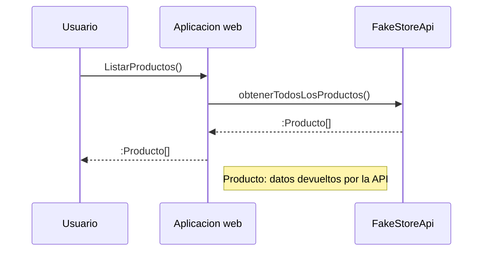

# E-commerce laboratorio RIA segunda entrega

Este repositorio tiene como principal objetivo, aplicar y reforzar los conocimientos obtenidos en la materia RIA, a través de la realización de una aplicación web de e-commerce, la cual cuenta con una pagina principal que muestra una lista de productos consumidos utilizando una public API llamada **Fake Store**, y otra segunda API llamada **Exchange-Rate**

- [# Fake Store API](https://fakestoreapi.com/)
- [# Exchange Rate API](https://www.exchangerate-api.com/)

## Pasos para levantar el proyecto

1.  Clonar este Repositorio en una maquina local
    ```
      git clone <URL REPO> .
    ```
2.  Pararse en directorio root del proyecto
    ```
      cd <directorio root>
    ```
3.  Instalar las dependencias del proyecto
    ```
    yarn
    ```
4.  Levantar el proyecto
    ```
     yarn dev --open
    ```

## UML diagrams



## Mockup de la Aplicación


## Historias de usuario:

• Historia de Usuario 1: Visualización de Catálogo de Productos

- Como usuario,
- quiero ver un catálogo de productos,
- para poder navegar y seleccionar productos de mi interés.

Criterios de Aceptación:

1. El usuario puede ver una lista de productos con sus imágenes, nombres y precios.
2. Cada producto debe tener una imagen de tamaño uniforme para una mejor visualización.
3. Las tarjetas de productos deben ser de tamaño uniforme y mostrar el nombre y el precio del producto.
4. El usuario puede hacer clic en un producto para ver más detalles.

• Historia de Usuario 2: Detalles del Producto

- Como usuario,
- quiero ver detalles específicos de un producto,
- para obtener más información antes de decidir una compra.

Criterios de Aceptación:

1. El usuario puede hacer clic en un producto desde el catálogo para ver una página de detalles del producto.
2. La página de detalles debe mostrar una imagen grande del producto, el nombre del producto, una descripción detallada y el precio.
3. El usuario debe tener una opción para regresar al catálogo de productos.

• Historia de Usuario 3: Conversión de Moneda

- Como usuario,
- quiero ver las cotizaciones de monedas actualizadas,
- para conocer el precio de los productos en diferentes monedas.

Criterios de Aceptación:

1. El usuario puede ver el precio del producto en diferentes monedas.
2. La página de detalles del producto debe incluir una sección para la conversión de moneda.
3. El usuario debe poder seleccionar una moneda diferente y ver el precio del producto convertido a la moneda seleccionada.
4. Las tasas de cambio deben ser obtenidas de una API pública de cotizaciones de monedas.

• Ejemplo de Implementación:
Estas historias de usuario guiarán el desarrollo de nuestra aplicación e-commerce, asegurando que se enfoque en la experiencia del usuario y en proporcionar la funcionalidad necesaria de manera clara y eficiente.
