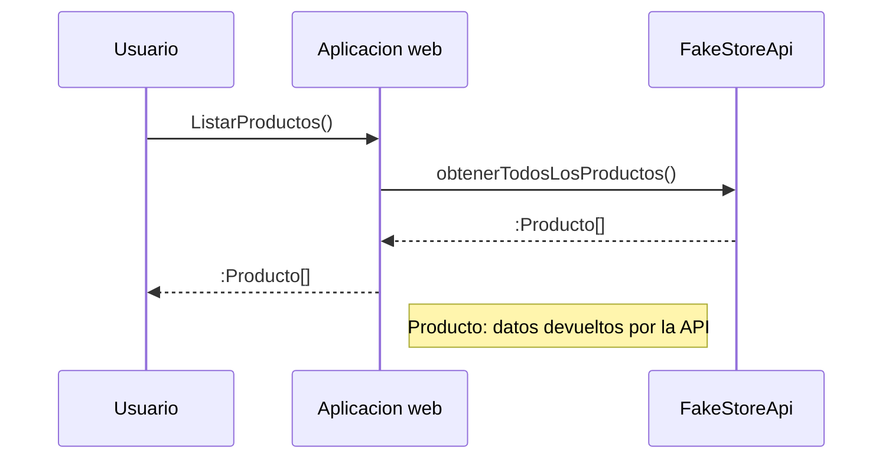

# E-commerce laboratorio RIA segunda entrega

Este repositorio tiene como principal objetivo, aplicar y reforzar los conocimientos obtenidos en la materia RIA, a través de la realización de una aplicación web de e-commerce, la cual cuenta con una pagina principal que muestra una lista de productos consumidos utilizando una public API llamada **Fake Store**

- [# Fake Store API](https://fakestoreapi.com/)

## Pasos para levantar el proyecto

1.  Clonar este Repositorio en una maquina local
    ```
      git clone <URL REPO> .
    ```
2.  Pararse en directorio root del proyecto
    ```
      cd <directorio root>
    ```
3.  Instalar las dependencias del proyecto
    ```
    yarn
    ```
4.  Levantar el proyecto
    ```
     yarn dev --open
    ```

## UML diagrams


